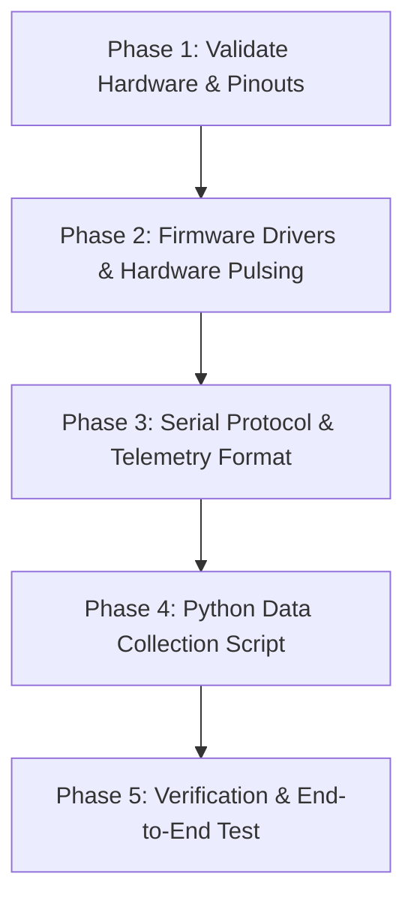

# Hardware Integration & Raw Data Collection Specification

## Overview
This document serves as the master specification for your Coding Agent (Agent CLI) to execute Phase 4 hardware integration on the **NXP FRDM-MCXN236** platform.

The target system performs real-time optical fluorescence sensing for microplastic detection:
1. **Excitation:** 525 nm Green LED pulsed via MCU GPIO.
2. **Sensing:** BPW34 Silicon PIN Photodiode connected through a zero-bias reference network into a single-supply TLC271 transimpedance/op-amp stage (Offset-Null tuned).
3. **Data Acquisition:** Analog voltage output sampled by the FRDM-MCXN236 ADC.
4. **Telemetry & Collection:** Pulse data processed and output over MCU-Link Virtual COM Port (`UART`, 115200 8-N-1) to a host Python script that records raw continuous ADC time-series data into `raw_fluorescence_data.csv`.

---

## 1. Hardware Pinout & Wiring Specification

### 1.1 Microcontroller Pin Mapping (NXP FRDM-MCXN236)

| Circuit Function | Hardware Component | FRDM-MCXN236 Pin / Header | Signal Description | Configuration Parameters |
| :--- | :--- | :--- | :--- | :--- |
| **LED Driver Control** | 525 nm Green LED Gate Signal | **GPIO (e.g., P0_10 or Board LED/GPIO pin)** | Digital Output | Active HIGH / Push-Pull / 3.3V Logic |
| **Photodiode Signal Input** | TLC271 Op-Amp Output (Pin 6) | **ADC0 Input Channel (e.g., ADC0_CH0 / P0_16)** | Analog Input | 0.0V - 3.3V range, 12-bit or 16-bit resolution |
| **UART Telemetry TX** | On-board MCU-Link VCOM | **UART0_TX (P1_8 / Virtual COM)** | Serial Output | 115200 Baud, 8 Data bits, No Parity, 1 Stop bit |
| **UART Telemetry RX** | On-board MCU-Link VCOM | **UART0_RX (P1_9 / Virtual COM)** | Serial Input | 115200 Baud, 8 Data bits, No Parity, 1 Stop bit |
| **Ground Reference** | Analog & Digital GND | **GND Header Pin** | Common Ground | Shared system ground |
| **System Power** | TLC271 VCC Supply | **3V3 Header Pin** | Power Rail | 3.3V DC |

---

### 1.2 Analog Front-End Schematic Topology & Wiring Guide

```
                     +3.3V (VCC)
                       |
                      [R1: 10 Ohm Trimmer]
                       |
                       +-----> Photodiode Cathode (BPW34 Pin 1)
                       |
                      [R2: 22 Ohm]
                       |
                      GND

  +-------------------------------------------------------------+
  |                                                             |
  |  BPW34 Photodiode (D1)                                      |
  |  - Anode -> Non-Inverting Input (TLC271 Pin 3)              |
  |  - Cathode -> Biased at R1/R2 Junction                      |
  +-------------------------------------------------------------+

             +3.3V (VCC)
               |
          +----+----+
          | Pin 7   |
   Pin 3  |         | Pin 6
  ------->| TLC271  |-------------------+-----> MCU ADC Input Pin (ADC0)
          | Op-Amp  |                   |
   Pin 2  |         |                   |
  +------>|         |                   |
  |       +----+----+                   |
  |            | Pin 4                  |
  |           GND                       |
  |                                     |
  +-----[ R4: 10 kOhm Feedback ]--------+
  |
 [R3: 500 Ohm Trimmer (Wiper to Pin 2, Terminals across Pins 1 & 5 Offset Null)]
```

* **Photodiode Connection:** BPW34 PIN Photodiode connected near zero-bias photovoltaic operation using the `10 Ω` trimmer (R1) and `22 Ω` resistor (R2) network.
* **Offset Nulling Adjustment:** Adjust the 500 Ω trimmer (R3) connected across TLC271 Pins 1 and 5 to zero out residual DC offset when the excitation LED is off (dark condition offset ≤ 5 mV).

---

## 2. Firmware Modification Specification (C / MCUXpresso SDK)

The Agent must modify the repository's firmware to support automated optical pulse driving, ADC burst sampling, feature calculation, and raw serial stream output.

### Key Firmware Tasks for Agent:
1. **Initialize Peripherals:**
   - Configure GPIO pin for `LED_EXCITE_PIN` as output, default LOW.
   - Configure `ADC0` channel for single-ended sampling with 12-bit / 16-bit resolution.
   - Configure `UART0` debug console at 115200 baud.
2. **Implement Pulse-and-Sample Loop:**
   - Turn ON LED (`LED_EXCITE_PIN = 1`).
   - Introduce a small turn-on stabilization delay (~1-2 ms).
   - Perform a consecutive sequence of $N$ samples (e.g., $N=200$ samples over a 50 ms window).
   - Turn OFF LED (`LED_EXCITE_PIN = 0`).
3. **Format Serial Output for Data Harvester:**
   - Stream raw ADC continuous values over UART formatted as clean CSV strings:
     `RAW,<sample_index>,<timestamp_ms>,<adc_counts>,<voltage_volts>`
   - Stream computed pulse summary features upon completion:
     `DATA,<peak_intensity>,<mean_intensity>,<rise_time_ms>,<decay_time_ms>,<pulse_energy>`

---

## 3. Host Python Script Specification (`raw_data_collector.py`)

The Agent must create a robust Python automated harvesting script to log serial data into a structured CSV dataset (`raw_fluorescence_data.csv`).

### Implementation Rules for `raw_data_collector.py`:
- Use `pyserial` to connect to the MCU Virtual COM port (e.g., `COM9` on Windows or `/dev/ttyACM0` on Linux).
- Automatically detect incoming serial lines.
- Filter and store headers: `sample_id`, `timestamp_ms`, `raw_adc`, `voltage_v`, `pulse_stage`.
- Save all collected observations safely into `raw_fluorescence_data.csv`.

---

## 4. Step-by-Step Agent Action Plan



### Task Checklist for Agent CLI:
- [ ] **Step 1:** Verify pin assignment constants in `board_pins.h` / `hardware_init.c`. Set `LED_GPIO_PORT`, `LED_GPIO_PIN`, and `ADC_CHANNEL`.
- [ ] **Step 2:** Add hardware pulse trigger function `Acquire_Fluorescence_Pulse()` in `sensing_driver.c`.
- [ ] **Step 3:** Enable UART raw streaming output in `main.c`.
- [ ] **Step 4:** Build the project using CMake / Ninja / MCUXpresso toolchain.
- [ ] **Step 5:** Write `scripts/raw_data_collector.py` supporting CLI flags (`--port`, `--baud`, `--output`, `--samples`).
- [ ] **Step 6:** Execute validation sequence to confirm zero-noise readings with optical shielding and valid peak signals upon excitation.
